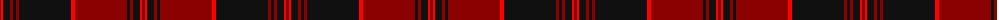

The parent of this is [Old Aberdeen Diamond Jubilee](/tartans/dr/3/r2/k7/dr3/k3/dr3/k52/r4/dr52/k3/dr3/k7/r2/dr/3/)

This was sourced from register-of-tartans.  It is a [14 stripes tartan](/stripes/stripes14/).

Original link https://www.tartanregister.gov.uk/tartanDetails.aspx?ref=10546

## Thread count
DR/3 R2 K7 DR3 K3 DR3 K52 R4 DR52 K3 DR3 K7 R2 DR/3

## Palette
Each colour and its ΔE from the base-6 reference it is a variant of.

| Colour | Shade | Base | ΔE (OKLab) |
|---|---|---|---|
| DR |  `#8B0000` | R  | 0.13 |
| K |  `#101010` | K  | 0.17 |
| R |  `#FF0000` | R  | 0.11 |

ID: /variants/dr/3/r2/k7/dr3/k3/dr3/k52/r4/dr52/k3/dr3/k7/r2/dr/3-dr8b0000-k101010-rff0000/
