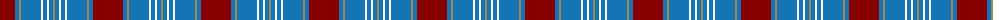

The parent of this is [Rafferty (Fashion)](/tartans/dr/30/b4/lt2/b20/w2/b4/w2/b4/lt/2/)

This was sourced from tartans-authority.  It is a [9 stripes tartan](/stripes/stripes9/).

Original link http://www.tartansauthority.com/tartan-ferret/display/6749/

## Thread count
DR/30 B4 LT2 B20 W2 B4 W2 B4 LT/2

## Palette
Each colour and its ΔE from the base-6 reference it is a variant of.

| Colour | Shade | Base | ΔE (OKLab) |
|---|---|---|---|
| B |  `#1474B4` | B  | 0.15 |
| DR |  `#880000` | R  | 0.14 |
| LT |  `#A08858` | Y  | 0.21 |
| W |  `#F8F8F8` | W  | 0.01 |

ID: /variants/dr/30/b4/lt2/b20/w2/b4/w2/b4/lt/2-b1474b4-dr880000-lta08858-wf8f8f8/
