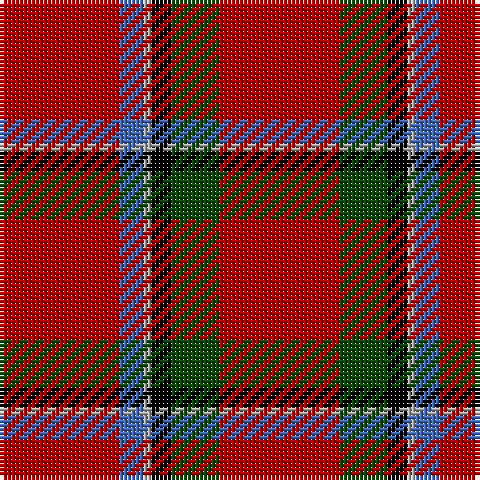

The parent of this is [Sinclair](/tartans/dr/30/b6/n2/k5/dg12/dr/30/)

This was sourced from weddslist.  It is a [6 stripes tartan](/stripes/stripes6/).

Original link http://www.weddslist.com/cgi-bin/tartans/pg.pl?source=x

## Thread count
DR/30 B6 N2 K5 DG12 DR/30

## Palette
Each colour and its ΔE from the base-6 reference it is a variant of.

| Colour | Shade | Base | ΔE (OKLab) |
|---|---|---|---|
| B |  `#4367AE` | B  | 0.13 |
| DG |  `#11450D` | G  | 0.10 |
| DR |  `#AA0000` | R  | 0.06 |
| K |  `#000000` | K  | 0.00 |
| N |  `#AAAAAA` | Y  | 0.19 |

# Sample pattern

ID: /variants/dr/30/b6/n2/k5/dg12/dr/30-b4367ae-dg11450d-draa0000-k000000-naaaaaa/
