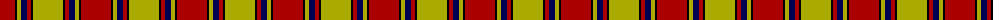
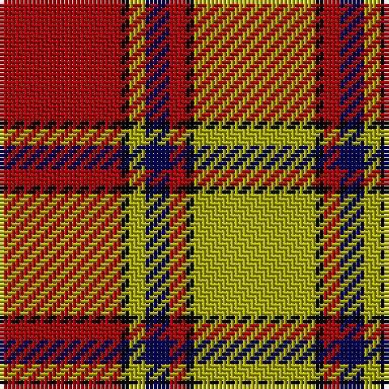

The parent of this is [Scrymgeour](/tartans/dr/30/k2/lg4/db6/dr4/k2/lg/30/)

This was sourced from weddslist.  It is a [7 stripes tartan](/stripes/stripes7/).

Original link http://www.weddslist.com/cgi-bin/tartans/pg.pl?source=tinsel

## Thread count
DR/30 K2 LG4 DB6 DR4 K2 LG/30

## Palette
Each colour and its ΔE from the base-6 reference it is a variant of.

| Colour | Shade | Base | ΔE (OKLab) |
|---|---|---|---|
| DB |  `#000052` | B  | 0.20 |
| DR |  `#AA0000` | R  | 0.06 |
| K |  `#000000` | K  | 0.00 |
| LG |  `#AAAA00` | Y  | 0.11 |

# Sample pattern

ID: /variants/dr/30/k2/lg4/db6/dr4/k2/lg/30-db000052-draa0000-k000000-lgaaaa00/
