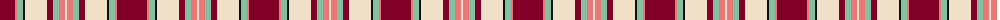

The parent of this is [Etive, Burgundy (Dance)](/tartans/dr/30/lr2/lg6/k2/w22/dr6/lg6/lr6/w/2/)

This was sourced from tartans-authority.  It is a [9 stripes tartan](/stripes/stripes9/).

Original link http://www.tartansauthority.com/tartan-ferret/display/7576/

## Thread count
DR/30 LR2 LG6 K2 W22 DR6 LG6 LR6 W/2

## Palette
Each colour and its ΔE from the base-6 reference it is a variant of.

| Colour | Shade | Base | ΔE (OKLab) |
|---|---|---|---|
| DR |  `#800028` | R  | 0.16 |
| K |  `#101010` | K  | 0.17 |
| LG |  `#84C0A0` | Y  | 0.17 |
| LR |  `#E87878` | R  | 0.19 |
| W |  `#F0E0C8` | W  | 0.06 |

ID: /variants/dr/30/lr2/lg6/k2/w22/dr6/lg6/lr6/w/2-dr800028-k101010-lg84c0a0-lre87878-wf0e0c8/
