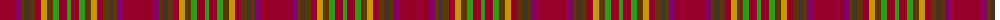

The parent of this is [Unidentified Chair Covering](/tartans/dr/30/p6/t4/ta4/t6/dr6/dy6/t6/g6/dr8/g/4/)

This was sourced from register-of-tartans.  It is a [11 stripes tartan](/stripes/stripes11/).

Original link https://www.tartanregister.gov.uk/tartanDetails.aspx?ref=4287

## Thread count
DR/30 P6 T4 Ta4 T6 DR6 DY6 T6 G6 DR8 G/4

## Palette
Each colour and its ΔE from the base-6 reference it is a variant of.

| Colour | Shade | Base | ΔE (OKLab) |
|---|---|---|---|
| DR |  `#960028` | R  | 0.11 |
| DY |  `#C89600` | Y  | 0.12 |
| G |  `#309C18` | G  | 0.18 |
| P |  `#840068` | B  | 0.18 |
| T |  `#5B360B` | G  | 0.17 |
| Ta |  `#443428` | B  | 0.15 |

ID: /variants/dr/30/p6/t4/ta4/t6/dr6/dy6/t6/g6/dr8/g/4-dr960028-dyc89600-g309c18-p840068-t5b360b-ta443428/
