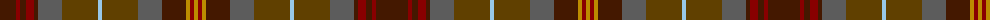

The parent of this is [Allen - 2012 (Personal)](/tartans/dr/32/dra4/dr6/dra8/dr4/n24/t36/lb4/t36/n24/dr24/dy4/dra4/dy/4/)

This was sourced from tartans-authority.  It is a [14 stripes tartan](/stripes/stripes14/).

Original link http://www.tartansauthority.com/tartan-ferret/display/10573/

## Thread count
DR/32 DRa4 DR6 DRa8 DR4 N24 T36 LB4 T36 N24 DR24 DY4 DRa4 DY/4

## Palette
Each colour and its ΔE from the base-6 reference it is a variant of.

| Colour | Shade | Base | ΔE (OKLab) |
|---|---|---|---|
| DR |  `#441800` | B  | 0.22 |
| DRa |  `#880000` | R  | 0.14 |
| DY |  `#BC8C00` | Y  | 0.16 |
| LB |  `#98C8E8` | W  | 0.17 |
| N |  `#5C5C5C` | B  | 0.14 |
| T |  `#604000` | G  | 0.14 |

ID: /variants/dr/32/dra4/dr6/dra8/dr4/n24/t36/lb4/t36/n24/dr24/dy4/dra4/dy/4-dr441800-dra880000-dybc8c00-lb98c8e8-n5c5c5c-t604000/
