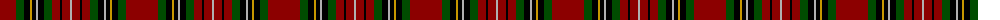

The parent of this is [Unidentified #53](/tartans/dr/32/g8/k6/dy2/k4/n2/k6/g8/dr8/k2/dr8/n/2/)

This was sourced from register-of-tartans.  It is a [12 stripes tartan](/stripes/stripes12/).

Original link https://www.tartanregister.gov.uk/tartanDetails.aspx?ref=4254

## Thread count
DR/32 G8 K6 DY2 K4 N2 K6 G8 DR8 K2 DR8 N/2

## Palette
Each colour and its ΔE from the base-6 reference it is a variant of.

| Colour | Shade | Base | ΔE (OKLab) |
|---|---|---|---|
| DR |  `#8C0000` | R  | 0.13 |
| DY |  `#C89800` | Y  | 0.12 |
| G |  `#004C00` | G  | 0.08 |
| K |  `#000000` | K  | 0.00 |
| N |  `#B0B0B0` | Y  | 0.18 |

ID: /variants/dr/32/g8/k6/dy2/k4/n2/k6/g8/dr8/k2/dr8/n/2-dr8c0000-dyc89800-g004c00-k000000-nb0b0b0/
