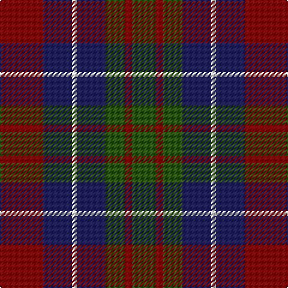

The parent of this is [Brough (Name)](/tartans/dr/36/db24/w4/db24/g16/dr6/g/20/)

This was sourced from tartans-authority.  It is a [7 stripes tartan](/stripes/stripes7/).

Original link http://www.tartansauthority.com/tartan-ferret/display/2233/

## Thread count
DR/36 DB24 W4 DB24 G16 DR6 G/20

## Palette
Each colour and its ΔE from the base-6 reference it is a variant of.

| Colour | Shade | Base | ΔE (OKLab) |
|---|---|---|---|
| DB |  `#202060` | B  | 0.11 |
| DR |  `#880000` | R  | 0.14 |
| G |  `#285800` | G  | 0.04 |
| W |  `#FCFCFC` | W  | 0.03 |

# Sample pattern

ID: /variants/dr/36/db24/w4/db24/g16/dr6/g/20-db202060-dr880000-g285800-wfcfcfc/
