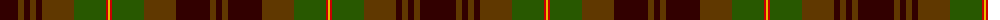

The parent of this is [Lander (2013)](/tartans/dr/36/t6/dr6/t6/dr6/t32/g32/r2/y2/r2/g32/t32/dr34/t6/dr/6/)

This was sourced from tartans-authority.  It is a [15 stripes tartan](/stripes/stripes15/).

Original link http://www.tartansauthority.com/tartan-ferret/display/10951/

## Thread count
DR/36 T6 DR6 T6 DR6 T32 G32 R2 Y2 R2 G32 T32 DR34 T6 DR/6

## Palette
Each colour and its ΔE from the base-6 reference it is a variant of.

| Colour | Shade | Base | ΔE (OKLab) |
|---|---|---|---|
| DR |  `#320000` | K  | 0.22 |
| G |  `#285800` | G  | 0.04 |
| R |  `#C80000` | R  | 0.00 |
| T |  `#603800` | G  | 0.16 |
| Y |  `#E8C000` | Y  | 0.00 |

ID: /variants/dr/36/t6/dr6/t6/dr6/t32/g32/r2/y2/r2/g32/t32/dr34/t6/dr/6-dr320000-g285800-rc80000-t603800-ye8c000/
