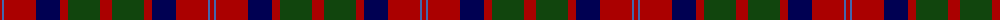

The parent of this is [MacQuarrie LO](/tartans/dr/4/b2/dr32/db24/dr8/dg32/dr/12/)

This was sourced from weddslist.  It is a [7 stripes tartan](/stripes/stripes7/).

Original link http://www.weddslist.com/cgi-bin/tartans/pg.pl?source=x

## Thread count
DR/4 B2 DR32 DB24 DR8 DG32 DR/12

## Palette
Each colour and its ΔE from the base-6 reference it is a variant of.

| Colour | Shade | Base | ΔE (OKLab) |
|---|---|---|---|
| B |  `#4367AE` | B  | 0.13 |
| DB |  `#000052` | B  | 0.20 |
| DG |  `#11450D` | G  | 0.10 |
| DR |  `#AA0000` | R  | 0.06 |

# Sample pattern

ID: /variants/dr/4/b2/dr32/db24/dr8/dg32/dr/12-b4367ae-db000052-dg11450d-draa0000/
