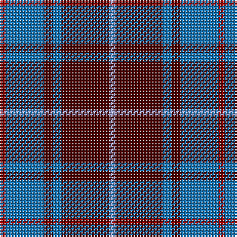

The parent of this is [MacArthur-Fox Blue (Personal)](/tartans/dr/4/b26/dra6/b6/dra32/lp/4/)

This was sourced from tartans-authority.  It is a [6 stripes tartan](/stripes/stripes6/).

Original link http://www.tartansauthority.com/tartan-ferret/display/459/

## Thread count
DR/4 B26 DRa6 B6 DRa32 LP/4

## Palette
Each colour and its ΔE from the base-6 reference it is a variant of.

| Colour | Shade | Base | ΔE (OKLab) |
|---|---|---|---|
| B |  `#1474B4` | B  | 0.15 |
| DR |  `#A00000` | R  | 0.09 |
| DRa |  `#4C0000` | B  | 0.24 |
| LP |  `#A8ACE8` | W  | 0.22 |

# Sample pattern

ID: /variants/dr/4/b26/dra6/b6/dra32/lp/4-b1474b4-dra00000-dra4c0000-lpa8ace8/
