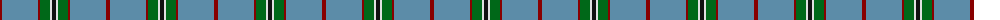

The parent of this is [Norris (1998) (Name)](/tartans/dr/4/b36/dr2/g10/ln2/k/4/)

This was sourced from tartans-authority.  It is a [6 stripes tartan](/stripes/stripes6/).

Original link http://www.tartansauthority.com/tartan-ferret/display/5942/

## Thread count
DR/4 B36 DR2 G10 LN2 K/4

## Palette
Each colour and its ΔE from the base-6 reference it is a variant of.

| Colour | Shade | Base | ΔE (OKLab) |
|---|---|---|---|
| B |  `#5C8CA8` | B  | 0.23 |
| DR |  `#880000` | R  | 0.14 |
| G |  `#006818` | G  | 0.02 |
| K |  `#101010` | K  | 0.17 |
| LN |  `#E0E0E0` | W  | 0.06 |

# Sample pattern

ID: /variants/dr/4/b36/dr2/g10/ln2/k/4-b5c8ca8-dr880000-g006818-k101010-lne0e0e0/
