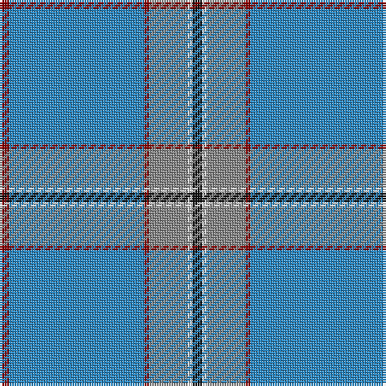

The parent of this is [Norris Htg (Name)](/tartans/dr/4/b56/dr2/n16/ln2/k/4/)

This was sourced from tartans-authority.  It is a [6 stripes tartan](/stripes/stripes6/).

Original link http://www.tartansauthority.com/tartan-ferret/display/5944/

## Thread count
DR/4 B56 DR2 N16 LN2 K/4

## Palette
Each colour and its ΔE from the base-6 reference it is a variant of.

| Colour | Shade | Base | ΔE (OKLab) |
|---|---|---|---|
| B |  `#2888C4` | B  | 0.21 |
| DR |  `#880000` | R  | 0.14 |
| K |  `#101010` | K  | 0.17 |
| LN |  `#E0E0E0` | W  | 0.06 |
| N |  `#888888` | R  | 0.24 |

# Sample pattern

ID: /variants/dr/4/b56/dr2/n16/ln2/k/4-b2888c4-dr880000-k101010-lne0e0e0-n888888/
