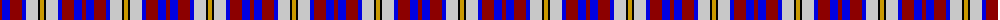
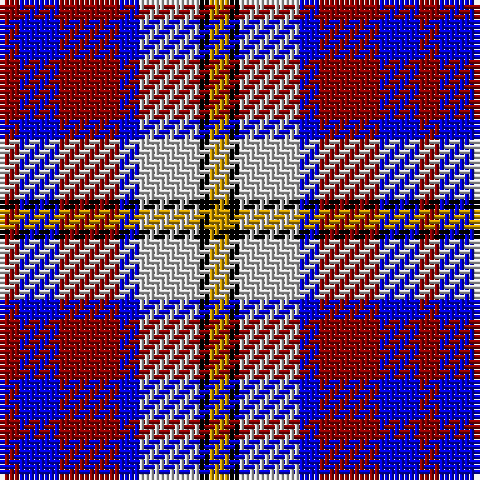

The parent of this is [Unidentified Printing](/tartans/dr/4/b8/dr12/b4/n12/k2/dy/4/)

This was sourced from register-of-tartans.  It is a [7 stripes tartan](/stripes/stripes7/).

Original link https://www.tartanregister.gov.uk/tartanDetails.aspx?ref=4359

## Thread count
DR/4 B8 DR12 B4 N12 K2 DY/4

## Palette
Each colour and its ΔE from the base-6 reference it is a variant of.

| Colour | Shade | Base | ΔE (OKLab) |
|---|---|---|---|
| B |  `#0000E0` | B  | 0.17 |
| DR |  `#8C0000` | R  | 0.13 |
| DY |  `#C89800` | Y  | 0.12 |
| K |  `#000000` | K  | 0.00 |
| N |  `#C8C8C8` | W  | 0.13 |

# Sample pattern

ID: /variants/dr/4/b8/dr12/b4/n12/k2/dy/4-b0000e0-dr8c0000-dyc89800-k000000-nc8c8c8/
