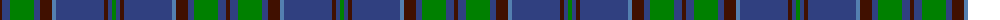

The parent of this is [Wicklow](/tartans/dr/4/b8/g24/b6/dr12/ba4/b48/dr4/b4/g/4/)

This was sourced from weddslist.  It is a [10 stripes tartan](/stripes/stripes10/).

Original link http://www.weddslist.com/cgi-bin/tartans/pg.pl?source=sts

## Thread count
DR/4 B8 G24 B6 DR12 Ba4 B48 DR4 B4 G/4

## Palette
Each colour and its ΔE from the base-6 reference it is a variant of.

| Colour | Shade | Base | ΔE (OKLab) |
|---|---|---|---|
| B |  `#304080` | B  | 0.01 |
| Ba |  `#5480B0` | B  | 0.20 |
| DR |  `#401000` | B  | 0.23 |
| G |  `#008000` | G  | 0.09 |

ID: /variants/dr/4/b8/g24/b6/dr12/ba4/b48/dr4/b4/g/4-b304080-ba5480b0-dr401000-g008000/
