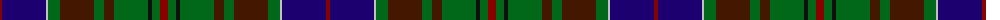

The parent of this is [Adams (Name)](/tartans/dr/4/db44/n2/g12/dra34/g10/dra10/g34/k4/g8/dr/8/)

This was sourced from tartans-authority.  It is a [11 stripes tartan](/stripes/stripes11/).

Original link http://www.tartansauthority.com/tartan-ferret/display/3022/

## Thread count
DR/4 DB44 N2 G12 DRa34 G10 DRa10 G34 K4 G8 DR/8

## Palette
Each colour and its ΔE from the base-6 reference it is a variant of.

| Colour | Shade | Base | ΔE (OKLab) |
|---|---|---|---|
| DB |  `#1C0070` | B  | 0.14 |
| DR |  `#880000` | R  | 0.14 |
| DRa |  `#441800` | B  | 0.22 |
| G |  `#006818` | G  | 0.02 |
| K |  `#101010` | K  | 0.17 |
| N |  `#C0C0C0` | W  | 0.16 |

ID: /variants/dr/4/db44/n2/g12/dra34/g10/dra10/g34/k4/g8/dr/8-db1c0070-dr880000-dra441800-g006818-k101010-nc0c0c0/
