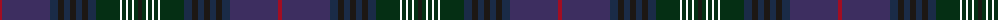

The parent of this is [Rendell, Charles Name Tartan Tartan Number: 10699. Earliest known date: 13 September 2012 Ailsa and Alex Rendell designed this tartan to celebrate their father’s 60th birthday. The colours and threadcount are inspired by the Kennedy tartan STR #1942 with purple as the main base colour to give it a modern feel. See products available Copyright © Blair Urquhart, Comrie, 2015](/tartans/dr/4/db48/dn8/k6/dn6/k6/dn6/k6/dn8/dg24/lp2/dg4/lp2/dg4/lp2/dg4/k/4/)

This was sourced from house-of-tartan.  It is a [17 stripes tartan](/stripes/stripes17/).

Original link http://www.house-of-tartan.scotland.net/house/TartanViewjs.asp?colr=Def&tnam=10699

## Thread count
DR/4 DB48 DN8 K6 DN6 K6 DN6 K6 DN8 DG24 LP2 DG4 LP2 DG4 LP2 DG4 K/4

## Palette
Each colour and its ΔE from the base-6 reference it is a variant of.

| Colour | Shade | Base | ΔE (OKLab) |
|---|---|---|---|
| DB |  `#3D2E60` | B  | 0.08 |
| DG |  `#052F14` | G  | 0.19 |
| DN |  `#1A2B47` | B  | 0.12 |
| DR |  `#A20D22` | R  | 0.08 |
| K |  `#1C1714` | K  | 0.21 |

ID: /variants/dr/4/db48/dn8/k6/dn6/k6/dn6/k6/dn8/dg24/lp2/dg4/lp2/dg4/lp2/dg4/k/4-db3d2e60-dg052f14-dn1a2b47-dra20d22-k1c1714/
