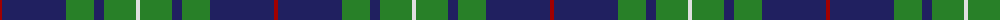

The parent of this is [Connacht Irish District Tartan Tartan Number: 4485. Earliest known date: 1994 Phil Smith obtained in Perthshire from a swatch dated 1994 shown to him by Keith Lumsden of the Scottish Tartans Society. However www.uniq-orn.com shows this as Connaught Green. See products available Copyright © Blair Urquhart, Comrie, 2015](/tartans/dr/4/db64/ga28/db10/ga32/ln/4/)

This was sourced from house-of-tartan.  It is a [6 stripes tartan](/stripes/stripes6/).

Original link http://www.house-of-tartan.scotland.net/house/TartanViewjs.asp?colr=Def&tnam=4485

## Thread count
DR/4 DB64 Ga28 DB10 Ga32 LN/4

## Palette
Each colour and its ΔE from the base-6 reference it is a variant of.

| Colour | Shade | Base | ΔE (OKLab) |
|---|---|---|---|
| DB |  `#202060` | B  | 0.11 |
| DR |  `#A00000` | R  | 0.09 |
| G |  `#5C6428` | G  | 0.09 |
| Ga |  `#288028` | G  | 0.09 |
| LN |  `#E0E0E0` | W  | 0.06 |
| N |  `#C0C0C0` | W  | 0.16 |

# Sample pattern

ID: /variants/dr/4/db64/ga28/db10/ga32/ln/4-db202060-dra00000-g5c6428-ga288028-lne0e0e0-nc0c0c0/
