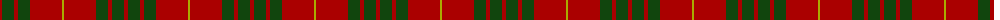
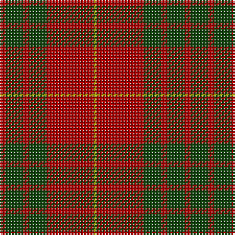

The parent of this is [Cameron](/tartans/dr/4/dg12/dr4/dg12/dr32/lg/2/)

This was sourced from weddslist.  It is a [6 stripes tartan](/stripes/stripes6/).

Original link http://www.weddslist.com/cgi-bin/tartans/pg.pl?source=x

## Thread count
DR/4 DG12 DR4 DG12 DR32 LG/2

## Palette
Each colour and its ΔE from the base-6 reference it is a variant of.

| Colour | Shade | Base | ΔE (OKLab) |
|---|---|---|---|
| DG |  `#11450D` | G  | 0.10 |
| DR |  `#AA0000` | R  | 0.06 |
| LG |  `#AAAA00` | Y  | 0.11 |

# Sample pattern

ID: /variants/dr/4/dg12/dr4/dg12/dr32/lg/2-dg11450d-draa0000-lgaaaa00/
