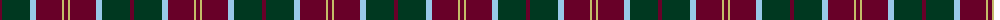
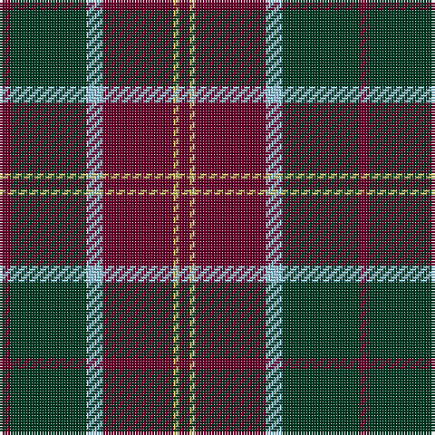

The parent of this is [Swedish Para Whisky Club (Corporate](/tartans/dr/4/dg28/lb6/dr26/lg2/dr/4/)

This was sourced from tartans-authority.  It is a [6 stripes tartan](/stripes/stripes6/).

Original link http://www.tartansauthority.com/tartan-ferret/display/8526/

## Thread count
DR/4 DG28 LB6 DR26 LG2 DR/4

## Palette
Each colour and its ΔE from the base-6 reference it is a variant of.

| Colour | Shade | Base | ΔE (OKLab) |
|---|---|---|---|
| DG |  `#003820` | G  | 0.16 |
| DR |  `#680028` | B  | 0.20 |
| LB |  `#98C8E8` | W  | 0.17 |
| LG |  `#C4BC68` | Y  | 0.07 |

# Sample pattern

ID: /variants/dr/4/dg28/lb6/dr26/lg2/dr/4-dg003820-dr680028-lb98c8e8-lgc4bc68/
