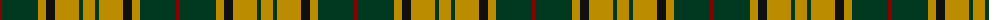

The parent of this is [Harmer (Corporate)](/tartans/dr/4/dg36/dy8/k9/dy24/dg4/dy/12/)

This was sourced from tartans-authority.  It is a [7 stripes tartan](/stripes/stripes7/).

Original link http://www.tartansauthority.com/tartan-ferret/display/2422/

## Thread count
DR/4 DG36 DY8 K9 DY24 DG4 DY/12

## Palette
Each colour and its ΔE from the base-6 reference it is a variant of.

| Colour | Shade | Base | ΔE (OKLab) |
|---|---|---|---|
| DG |  `#003820` | G  | 0.16 |
| DR |  `#880000` | R  | 0.14 |
| DY |  `#BC8C00` | Y  | 0.16 |
| K |  `#101010` | K  | 0.17 |

# Sample pattern

ID: /variants/dr/4/dg36/dy8/k9/dy24/dg4/dy/12-dg003820-dr880000-dybc8c00-k101010/
