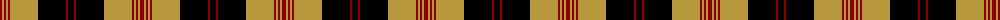

The parent of this is [Brecheen (Name)](/tartans/dr/4/do2/dr2/do2/dr2/do28/k28/dr2/k/6/)

This was sourced from tartans-authority.  It is a [9 stripes tartan](/stripes/stripes9/).

Original link http://www.tartansauthority.com/tartan-ferret/display/3727/

## Thread count
DR/4 DO2 DR2 DO2 DR2 DO28 K28 DR2 K/6

## Palette
Each colour and its ΔE from the base-6 reference it is a variant of.

| Colour | Shade | Base | ΔE (OKLab) |
|---|---|---|---|
| DO |  `#B8983C` | Y  | 0.14 |
| DR |  `#8C0000` | R  | 0.13 |
| K |  `#000000` | K  | 0.00 |

ID: /variants/dr/4/do2/dr2/do2/dr2/do28/k28/dr2/k/6-dob8983c-dr8c0000-k000000/
