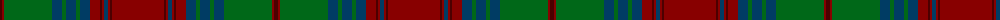

The parent of this is [Ladybird (Fashion)](/tartans/dr/4/dra2/g48/db10/g4/db10/g4/db10/dra10/dr2/dra2/db4/dra2/dr2/dra/52/)

This was sourced from tartans-authority.  It is a [15 stripes tartan](/stripes/stripes15/).

Original link http://www.tartansauthority.com/tartan-ferret/display/2371/

## Thread count
DR/4 DRa2 G48 DB10 G4 DB10 G4 DB10 DRa10 DR2 DRa2 DB4 DRa2 DR2 DRa/52

## Palette
Each colour and its ΔE from the base-6 reference it is a variant of.

| Colour | Shade | Base | ΔE (OKLab) |
|---|---|---|---|
| DB |  `#003C64` | B  | 0.07 |
| DR |  `#4C0000` | B  | 0.24 |
| DRa |  `#880000` | R  | 0.14 |
| G |  `#006818` | G  | 0.02 |

ID: /variants/dr/4/dra2/g48/db10/g4/db10/g4/db10/dra10/dr2/dra2/db4/dra2/dr2/dra/52-db003c64-dr4c0000-dra880000-g006818/
