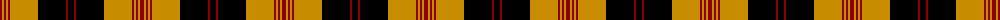

The parent of this is [Brecheen](/tartans/dr/4/dy2/dr2/dy2/dr2/dy28/k28/dr2/k/6/)

This was sourced from register-of-tartans.  It is a [9 stripes tartan](/stripes/stripes9/).

Original link https://www.tartanregister.gov.uk/tartanDetails.aspx?ref=5078

## Thread count
DR/4 DY2 DR2 DY2 DR2 DY28 K28 DR2 K/6

## Palette
Each colour and its ΔE from the base-6 reference it is a variant of.

| Colour | Shade | Base | ΔE (OKLab) |
|---|---|---|---|
| DR |  `#8C0000` | R  | 0.13 |
| DY |  `#C88C00` | Y  | 0.15 |
| K |  `#000000` | K  | 0.00 |

ID: /variants/dr/4/dy2/dr2/dy2/dr2/dy28/k28/dr2/k/6-dr8c0000-dyc88c00-k000000/
