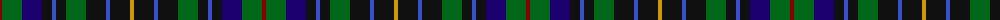

The parent of this is [Nairn (Edinburgh Woollen Mill)](/tartans/dr/4/g20/db20/k10/b4/k10/g20/k20/b4/k20/dy/4/)

This was sourced from register-of-tartans.  It is a [11 stripes tartan](/stripes/stripes11/).

Original link https://www.tartanregister.gov.uk/tartanDetails.aspx?ref=3090

## Thread count
DR/4 G20 DB20 K10 B4 K10 G20 K20 B4 K20 DY/4

## Palette
Each colour and its ΔE from the base-6 reference it is a variant of.

| Colour | Shade | Base | ΔE (OKLab) |
|---|---|---|---|
| B |  `#3850C8` | B  | 0.12 |
| DB |  `#1C0070` | B  | 0.14 |
| DR |  `#880000` | R  | 0.14 |
| DY |  `#D09800` | Y  | 0.11 |
| G |  `#006818` | G  | 0.02 |
| K |  `#101010` | K  | 0.17 |

ID: /variants/dr/4/g20/db20/k10/b4/k10/g20/k20/b4/k20/dy/4-b3850c8-db1c0070-dr880000-dyd09800-g006818-k101010/
