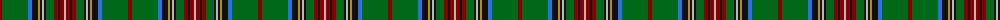

The parent of this is [Stewart (King George VI)](/tartans/dr/4/g22/g4/b4/k6/dy2/k2/na2/k2/g8/dr4/k2/dr4/na/2/)

This was sourced from register-of-tartans.  It is a [14 stripes tartan](/stripes/stripes14/).

Original link https://www.tartanregister.gov.uk/tartanDetails.aspx?ref=3930

## Thread count
DR/4 G22 G4 B4 K6 DY2 K2 Na2 K2 G8 DR4 K2 DR4 Na/2

## Palette
Each colour and its ΔE from the base-6 reference it is a variant of.

| Colour | Shade | Base | ΔE (OKLab) |
|---|---|---|---|
| B |  `#2474E8` | B  | 0.20 |
| DR |  `#880000` | R  | 0.14 |
| DY |  `#BC8C00` | Y  | 0.16 |
| G |  `#006818` | G  | 0.02 |
| K |  `#101010` | K  | 0.17 |
| N |  `#5C5C5C` | B  | 0.14 |
| Na |  `#B8B8B8` | Y  | 0.17 |

ID: /variants/dr/4/g22/g4/b4/k6/dy2/k2/na2/k2/g8/dr4/k2/dr4/na/2-b2474e8-dr880000-dybc8c00-g006818-k101010-n5c5c5c-nab8b8b8/
