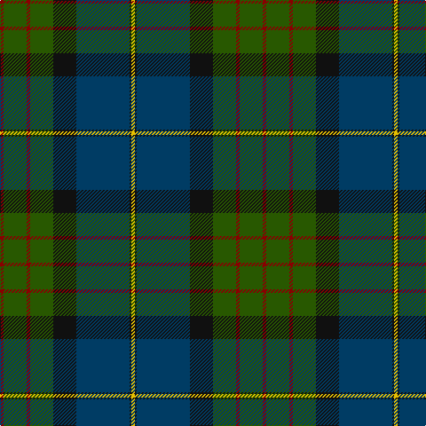

The parent of this is [Chan (Name?)](/tartans/dr/4/g26/dr4/g26/k26/db60/k2/y/4/)

This was sourced from tartans-authority.  It is a [8 stripes tartan](/stripes/stripes8/).

Original link http://www.tartansauthority.com/tartan-ferret/display/6423/

## Thread count
DR/4 G26 DR4 G26 K26 DB60 K2 Y/4

## Palette
Each colour and its ΔE from the base-6 reference it is a variant of.

| Colour | Shade | Base | ΔE (OKLab) |
|---|---|---|---|
| DB |  `#003C64` | B  | 0.07 |
| DR |  `#880000` | R  | 0.14 |
| G |  `#285800` | G  | 0.04 |
| K |  `#101010` | K  | 0.17 |
| Y |  `#E8C000` | Y  | 0.00 |

# Sample pattern

ID: /variants/dr/4/g26/dr4/g26/k26/db60/k2/y/4-db003c64-dr880000-g285800-k101010-ye8c000/
