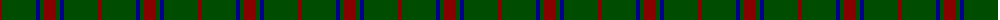
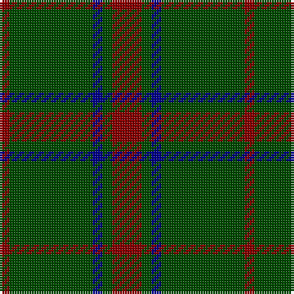

The parent of this is [Loton (Personal)](/tartans/dr/4/g34/db4/g4/dr/12/)

This was sourced from tartans-authority.  It is a [5 stripes tartan](/stripes/stripes5/).

Original link http://www.tartansauthority.com/tartan-ferret/display/5498/

## Thread count
DR/4 G34 DB4 G4 DR/12

## Palette
Each colour and its ΔE from the base-6 reference it is a variant of.

| Colour | Shade | Base | ΔE (OKLab) |
|---|---|---|---|
| DB |  `#00008C` | B  | 0.13 |
| DR |  `#880000` | R  | 0.14 |
| G |  `#004C00` | G  | 0.08 |

# Sample pattern

ID: /variants/dr/4/g34/db4/g4/dr/12-db00008c-dr880000-g004c00/
