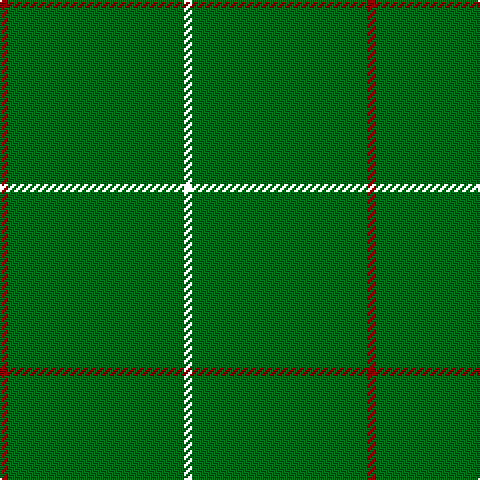

The parent of this is [Kenmore Hunting (Fashion)](/tartans/dr/4/g38/g4/g4/g38/g4/my/4/)

This was sourced from tartans-authority.  It is a [7 stripes tartan](/stripes/stripes7/).

Original link http://www.tartansauthority.com/tartan-ferret/display/2234/

## Thread count
DR/4 G38 G4 G4 G38 G4 MY/4

## Palette
Each colour and its ΔE from the base-6 reference it is a variant of.

| Colour | Shade | Base | ΔE (OKLab) |
|---|---|---|---|
| DR |  `#880000` | R  | 0.14 |
| G |  `#006818` | G  | 0.02 |

# Sample pattern

ID: /variants/dr/4/g38/g4/g4/g38/g4/my/4-dr880000-g006818/
