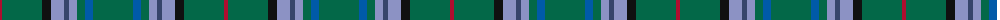

The parent of this is [Vorwerk, The](/tartans/dr/4/g40/k9/b13/bb5/b8/g8/ba8/g/40/)

This was sourced from register-of-tartans.  It is a [9 stripes tartan](/stripes/stripes9/).

Original link https://www.tartanregister.gov.uk/tartanDetails.aspx?ref=10437

## Thread count
DR/4 G40 K9 B13 Bb5 B8 G8 Ba8 G/40

## Palette
Each colour and its ΔE from the base-6 reference it is a variant of.

| Colour | Shade | Base | ΔE (OKLab) |
|---|---|---|---|
| B |  `#8C92C4` | Y  | 0.28 |
| Ba |  `#005AA8` | B  | 0.09 |
| Bb |  `#36446B` | B  | 0.05 |
| DR |  `#AE0D2F` | R  | 0.06 |
| G |  `#036848` | G  | 0.07 |
| K |  `#101010` | K  | 0.17 |

ID: /variants/dr/4/g40/k9/b13/bb5/b8/g8/ba8/g/40-b8c92c4-ba005aa8-bb36446b-drae0d2f-g036848-k101010/
