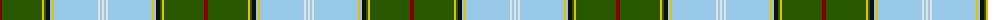

The parent of this is [Unidentified (Tony Murray Collection](/tartans/dr/4/g40/y2/g2/k4/lb2/y2/lb44/ln2/lb2/ln/2/)

This was sourced from tartans-authority.  It is a [11 stripes tartan](/stripes/stripes11/).

Original link http://www.tartansauthority.com/tartan-ferret/display/8841/

## Thread count
DR/4 G40 Y2 G2 K4 LB2 Y2 LB44 LN2 LB2 LN/2

## Palette
Each colour and its ΔE from the base-6 reference it is a variant of.

| Colour | Shade | Base | ΔE (OKLab) |
|---|---|---|---|
| DR |  `#880000` | R  | 0.14 |
| G |  `#285800` | G  | 0.04 |
| K |  `#101010` | K  | 0.17 |
| LB |  `#98C8E8` | W  | 0.17 |
| LN |  `#E0E0E0` | W  | 0.06 |
| Y |  `#E8C000` | Y  | 0.00 |

ID: /variants/dr/4/g40/y2/g2/k4/lb2/y2/lb44/ln2/lb2/ln/2-dr880000-g285800-k101010-lb98c8e8-lne0e0e0-ye8c000/
