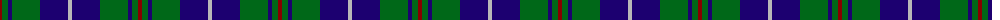

The parent of this is [Irving of Bonshaw Tower Personal Tartan Tartan Number: 2490. Earliest known date: 1993 April 1993. Designed by Dr. J. Bruce Irving -- a colour variation of Irvine (733) - and regarded as a Personal tartan, not to be confused with the Clan/Family tartan 'Irving of Bonshaw' (2609) which predates this. See products available Copyright © Blair Urquhart, Comrie, 2015](/tartans/dr/4/g6/db4/g28/db28/n/4/)

This was sourced from house-of-tartan.  It is a [6 stripes tartan](/stripes/stripes6/).

Original link http://www.house-of-tartan.scotland.net/house/TartanViewjs.asp?colr=Def&tnam=2490

## Thread count
DR/4 G6 DB4 G28 DB28 N/4

## Palette
Each colour and its ΔE from the base-6 reference it is a variant of.

| Colour | Shade | Base | ΔE (OKLab) |
|---|---|---|---|
| DB |  `#1C0070` | B  | 0.14 |
| DR |  `#880000` | R  | 0.14 |
| G |  `#006818` | G  | 0.02 |
| N |  `#B8B8B8` | Y  | 0.17 |

# Sample pattern

ID: /variants/dr/4/g6/db4/g28/db28/n/4-db1c0070-dr880000-g006818-nb8b8b8/
