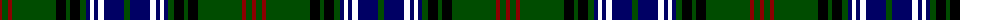

The parent of this is [Lochcarron Hunting Corporate Tartan Tartan Number: 5464. Earliest known date: 01/01/2002 Woven sample. See products available Copyright © Blair Urquhart, Comrie, 2015](/tartans/dr/4/g6/dr4/g44/k10/g4/k10/g6/db4/wwb4/db4/wwb6/db20/g/6/)

This was sourced from house-of-tartan.  It is a [14 stripes tartan](/stripes/stripes14/).

Original link http://www.house-of-tartan.scotland.net/house/TartanViewjs.asp?colr=Def&tnam=5464

## Thread count
DR/4 G6 DR4 G44 K10 G4 K10 G6 DB4 WWB4 DB4 WWB6 DB20 G/6

## Palette
Each colour and its ΔE from the base-6 reference it is a variant of.

| Colour | Shade | Base | ΔE (OKLab) |
|---|---|---|---|
| DB |  `#000064` | B  | 0.17 |
| DR |  `#8C0000` | R  | 0.13 |
| G |  `#004C00` | G  | 0.08 |
| K |  `#000000` | K  | 0.00 |

ID: /variants/dr/4/g6/dr4/g44/k10/g4/k10/g6/db4/wwb4/db4/wwb6/db20/g/6-db000064-dr8c0000-g004c00-k000000/
