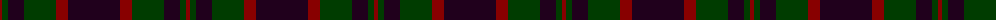
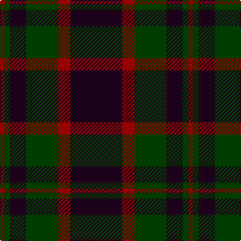

The parent of this is [Perthshire Tourist Board](/tartans/dr/4/g6/k16/g32/dr12/k/52/)

This was sourced from register-of-tartans.  It is a [6 stripes tartan](/stripes/stripes6/).

Original link https://www.tartanregister.gov.uk/tartanDetails.aspx?ref=3327

## Thread count
DR/4 G6 K16 G32 DR12 K/52

## Palette
Each colour and its ΔE from the base-6 reference it is a variant of.

| Colour | Shade | Base | ΔE (OKLab) |
|---|---|---|---|
| DR |  `#880000` | R  | 0.14 |
| G |  `#003C00` | G  | 0.13 |
| K |  `#20001C` | K  | 0.18 |

# Sample pattern

ID: /variants/dr/4/g6/k16/g32/dr12/k/52-dr880000-g003c00-k20001c/
