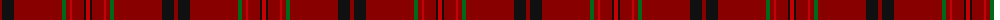

The parent of this is [Fitzgibbon Red (Name)](/tartans/dr/4/k12/dr48/g4/dr4/r2/dr12/k2/r/4/)

This was sourced from tartans-authority.  It is a [9 stripes tartan](/stripes/stripes9/).

Original link http://www.tartansauthority.com/tartan-ferret/display/10035/

## Thread count
DR/4 K12 DR48 G4 DR4 R2 DR12 K2 R/4

## Palette
Each colour and its ΔE from the base-6 reference it is a variant of.

| Colour | Shade | Base | ΔE (OKLab) |
|---|---|---|---|
| DR |  `#880000` | R  | 0.14 |
| G |  `#006818` | G  | 0.02 |
| K |  `#101010` | K  | 0.17 |
| R |  `#C80000` | R  | 0.00 |

ID: /variants/dr/4/k12/dr48/g4/dr4/r2/dr12/k2/r/4-dr880000-g006818-k101010-rc80000/
