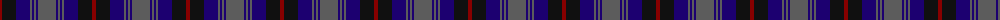
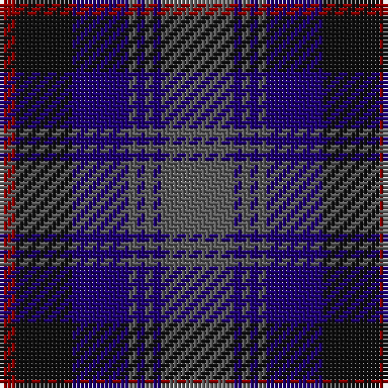

The parent of this is [Caledonian Hotel (Corporate)](/tartans/dr/4/k14/db14/n2/db2/n2/db2/n/18/)

This was sourced from register-of-tartans.  It is a [8 stripes tartan](/stripes/stripes8/).

Original link https://www.tartanregister.gov.uk/tartanDetails.aspx?ref=474

## Thread count
DR/4 K14 DB14 N2 DB2 N2 DB2 N/18

## Palette
Each colour and its ΔE from the base-6 reference it is a variant of.

| Colour | Shade | Base | ΔE (OKLab) |
|---|---|---|---|
| DB |  `#1C0070` | B  | 0.14 |
| DR |  `#880000` | R  | 0.14 |
| K |  `#101010` | K  | 0.17 |
| N |  `#5C5C5C` | B  | 0.14 |

# Sample pattern

ID: /variants/dr/4/k14/db14/n2/db2/n2/db2/n/18-db1c0070-dr880000-k101010-n5c5c5c/
