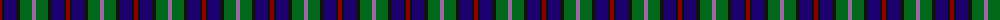
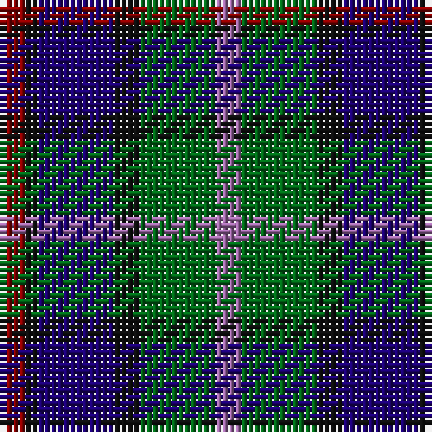

The parent of this is [MacEachain (Clan)](/tartans/dr/4/k2/db12/k4/g12/lp/4/)

This was sourced from tartans-authority.  It is a [6 stripes tartan](/stripes/stripes6/).

Original link http://www.tartansauthority.com/tartan-ferret/display/3359/

## Thread count
DR/4 K2 DB12 K4 G12 LP/4

## Palette
Each colour and its ΔE from the base-6 reference it is a variant of.

| Colour | Shade | Base | ΔE (OKLab) |
|---|---|---|---|
| DB |  `#1C0070` | B  | 0.14 |
| DR |  `#880000` | R  | 0.14 |
| G |  `#006818` | G  | 0.02 |
| K |  `#101010` | K  | 0.17 |
| LP |  `#9C68A4` | R  | 0.21 |

# Sample pattern

ID: /variants/dr/4/k2/db12/k4/g12/lp/4-db1c0070-dr880000-g006818-k101010-lp9c68a4/
