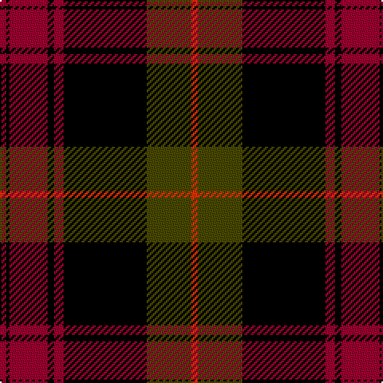

The parent of this is [Booth (Fashion)](/tartans/dr/4/k2/dr24/k4/dr6/k52/t28/r/4/)

This was sourced from tartans-authority.  It is a [8 stripes tartan](/stripes/stripes8/).

Original link http://www.tartansauthority.com/tartan-ferret/display/3713/

## Thread count
DR/4 K2 DR24 K4 DR6 K52 T28 R/4

## Palette
Each colour and its ΔE from the base-6 reference it is a variant of.

| Colour | Shade | Base | ΔE (OKLab) |
|---|---|---|---|
| DR |  `#9C0030` | R  | 0.10 |
| K |  `#000000` | K  | 0.00 |
| R |  `#FC3000` | R  | 0.12 |
| T |  `#484800` | G  | 0.10 |

# Sample pattern

ID: /variants/dr/4/k2/dr24/k4/dr6/k52/t28/r/4-dr9c0030-k000000-rfc3000-t484800/
