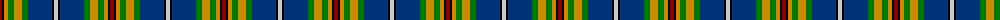

The parent of this is [FWI of Ontario (Corporate)](/tartans/dr/4/k2/dy4/g6/dy8/g6/db24/k2/n/4/)

This was sourced from tartans-authority.  It is a [9 stripes tartan](/stripes/stripes9/).

Original link http://www.tartansauthority.com/tartan-ferret/display/4840/

## Thread count
DR/4 K2 DY4 G6 DY8 G6 DB24 K2 N/4

## Palette
Each colour and its ΔE from the base-6 reference it is a variant of.

| Colour | Shade | Base | ΔE (OKLab) |
|---|---|---|---|
| DB |  `#003478` | B  | 0.06 |
| DR |  `#8C0000` | R  | 0.13 |
| DY |  `#C88C00` | Y  | 0.15 |
| G |  `#007800` | G  | 0.06 |
| K |  `#000000` | K  | 0.00 |
| N |  `#C8C8C8` | W  | 0.13 |

ID: /variants/dr/4/k2/dy4/g6/dy8/g6/db24/k2/n/4-db003478-dr8c0000-dyc88c00-g007800-k000000-nc8c8c8/
