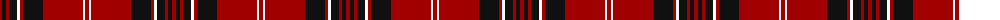

The parent of this is [University of South Carolina (Corp)](/tartans/dr/4/k4/dr3/k8/w3/dr3/k20/dr40/w2/dr/4/)

This was sourced from tartans-authority.  It is a [10 stripes tartan](/stripes/stripes10/).

Original link http://www.tartansauthority.com/tartan-ferret/display/10998/

## Thread count
DR/4 K4 DR3 K8 W3 DR3 K20 DR40 W2 DR/4

## Palette
Each colour and its ΔE from the base-6 reference it is a variant of.

| Colour | Shade | Base | ΔE (OKLab) |
|---|---|---|---|
| DR |  `#A00000` | R  | 0.09 |
| K |  `#101010` | K  | 0.17 |
| W |  `#FCFCFC` | W  | 0.03 |

ID: /variants/dr/4/k4/dr3/k8/w3/dr3/k20/dr40/w2/dr/4-dra00000-k101010-wfcfcfc/
