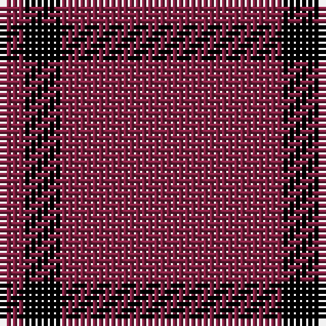

The parent of this is [Buie](/tartans/dr/4/k6/dr/36/)

This was sourced from weddslist.  It is a [3 stripes tartan](/stripes/stripes3/).

Original link http://www.weddslist.com/cgi-bin/tartans/pg.pl?source=sts

## Thread count
DR/4 K6 DR/36

## Palette
Each colour and its ΔE from the base-6 reference it is a variant of.

| Colour | Shade | Base | ΔE (OKLab) |
|---|---|---|---|
| DR |  `#802040` | R  | 0.16 |
| K |  `#000000` | K  | 0.00 |

# Sample pattern

ID: /variants/dr/4/k6/dr/36-dr802040-k000000/
