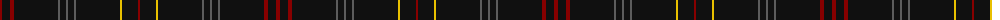

The parent of this is [Edinburgh Castle (Corporate?)](/tartans/dr/4/k8/dr4/k44/n2/k6/n2/k6/n2/k44/y2/k16/dr/2/)

This was sourced from tartans-authority.  It is a [13 stripes tartan](/stripes/stripes13/).

Original link http://www.tartansauthority.com/tartan-ferret/display/7958/

## Thread count
DR/4 K8 DR4 K44 N2 K6 N2 K6 N2 K44 Y2 K16 DR/2

## Palette
Each colour and its ΔE from the base-6 reference it is a variant of.

| Colour | Shade | Base | ΔE (OKLab) |
|---|---|---|---|
| DR |  `#880000` | R  | 0.14 |
| K |  `#101010` | K  | 0.17 |
| N |  `#5C5C5C` | B  | 0.14 |
| Y |  `#E8C000` | Y  | 0.00 |

ID: /variants/dr/4/k8/dr4/k44/n2/k6/n2/k6/n2/k44/y2/k16/dr/2-dr880000-k101010-n5c5c5c-ye8c000/
