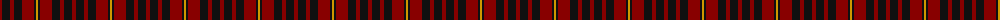
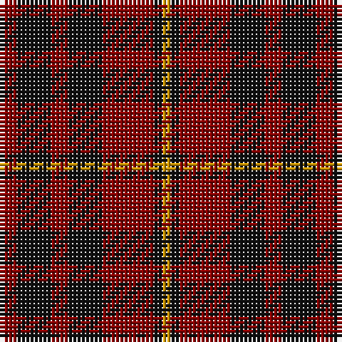

The parent of this is [MacIan](/tartans/dr/4/k8/dr4/k8/dr12/k2/dy/2/)

This was sourced from register-of-tartans.  It is a [7 stripes tartan](/stripes/stripes7/).

Original link https://www.tartanregister.gov.uk/tartanDetails.aspx?ref=5214

## Thread count
DR/4 K8 DR4 K8 DR12 K2 DY/2

## Palette
Each colour and its ΔE from the base-6 reference it is a variant of.

| Colour | Shade | Base | ΔE (OKLab) |
|---|---|---|---|
| DR |  `#880000` | R  | 0.14 |
| DY |  `#D09800` | Y  | 0.11 |
| K |  `#101010` | K  | 0.17 |

# Sample pattern

ID: /variants/dr/4/k8/dr4/k8/dr12/k2/dy/2-dr880000-dyd09800-k101010/
