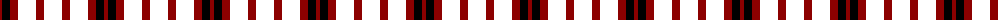

The parent of this is [Arrol (Corporate)](/tartans/dr/4/k8/dra8/g8/w2/g8/dra8/g8/w/2/)

This was sourced from tartans-authority.  It is a [9 stripes tartan](/stripes/stripes9/).

Original link http://www.tartansauthority.com/tartan-ferret/display/1365/

## Thread count
DR/4 K8 DRa8 G8 W2 G8 DRa8 G8 W/2

## Palette
Each colour and its ΔE from the base-6 reference it is a variant of.

| Colour | Shade | Base | ΔE (OKLab) |
|---|---|---|---|
| DR |  `#8C0000` | R  | 0.13 |
| DRa |  `#8C0000` | R  | 0.13 |
| K |  `#000000` | K  | 0.00 |

ID: /variants/dr/4/k8/dra8/g8/w2/g8/dra8/g8/w/2-dr8c0000-dra8c0000-k000000/
