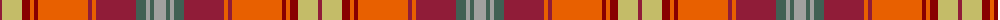

The parent of this is [Strathtay (District?)](/tartans/dr/4/lg20/dra8/o4/dra4/o50/dr4/o4/dr40/na10/n4/na4/n/12/)

This was sourced from tartans-authority.  It is a [13 stripes tartan](/stripes/stripes13/).

Original link http://www.tartansauthority.com/tartan-ferret/display/10115/

## Thread count
DR/4 LG20 DRa8 O4 DRa4 O50 DR4 O4 DR40 Na10 N4 Na4 N/12

## Palette
Each colour and its ΔE from the base-6 reference it is a variant of.

| Colour | Shade | Base | ΔE (OKLab) |
|---|---|---|---|
| DR |  `#901C38` | R  | 0.12 |
| DRa |  `#880000` | R  | 0.14 |
| LG |  `#C4BC68` | Y  | 0.07 |
| N |  `#A0A0A0` | Y  | 0.20 |
| Na |  `#406054` | G  | 0.11 |
| O |  `#E86000` | R  | 0.14 |

ID: /variants/dr/4/lg20/dra8/o4/dra4/o50/dr4/o4/dr40/na10/n4/na4/n/12-dr901c38-dra880000-lgc4bc68-na0a0a0-na406054-oe86000/
