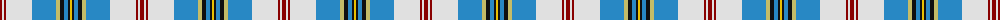

The parent of this is [Jong Nederland Born Union (Corp)](/tartans/dr/4/ln2/dr2/ln26/b24/lg4/k4/b4/k2/y/2/)

This was sourced from tartans-authority.  It is a [10 stripes tartan](/stripes/stripes10/).

Original link http://www.tartansauthority.com/tartan-ferret/display/3989/

## Thread count
DR/4 LN2 DR2 LN26 B24 LG4 K4 B4 K2 Y/2

## Palette
Each colour and its ΔE from the base-6 reference it is a variant of.

| Colour | Shade | Base | ΔE (OKLab) |
|---|---|---|---|
| B |  `#2888C4` | B  | 0.21 |
| DR |  `#880000` | R  | 0.14 |
| K |  `#101010` | K  | 0.17 |
| LG |  `#C4BC68` | Y  | 0.07 |
| LN |  `#E0E0E0` | W  | 0.06 |
| Y |  `#E8C000` | Y  | 0.00 |

ID: /variants/dr/4/ln2/dr2/ln26/b24/lg4/k4/b4/k2/y/2-b2888c4-dr880000-k101010-lgc4bc68-lne0e0e0-ye8c000/
