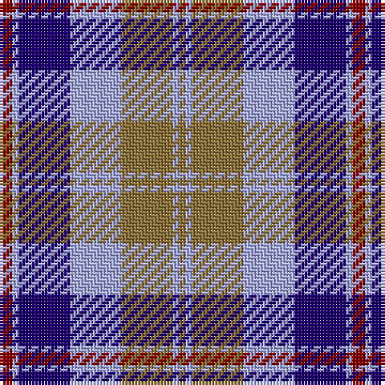

The parent of this is [Over Mountain (Commemorative)](/tartans/dr/4/lp2/db16/lp16/lt16/lp2/lt/2/)

This was sourced from tartans-authority.  It is a [7 stripes tartan](/stripes/stripes7/).

Original link http://www.tartansauthority.com/tartan-ferret/display/2448/

## Thread count
DR/4 LP2 DB16 LP16 LT16 LP2 LT/2

## Palette
Each colour and its ΔE from the base-6 reference it is a variant of.

| Colour | Shade | Base | ΔE (OKLab) |
|---|---|---|---|
| DB |  `#1C0070` | B  | 0.14 |
| DR |  `#880000` | R  | 0.14 |
| LP |  `#A8ACE8` | W  | 0.22 |
| LT |  `#8C7038` | G  | 0.18 |

# Sample pattern

ID: /variants/dr/4/lp2/db16/lp16/lt16/lp2/lt/2-db1c0070-dr880000-lpa8ace8-lt8c7038/
