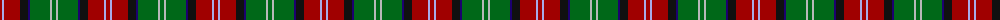
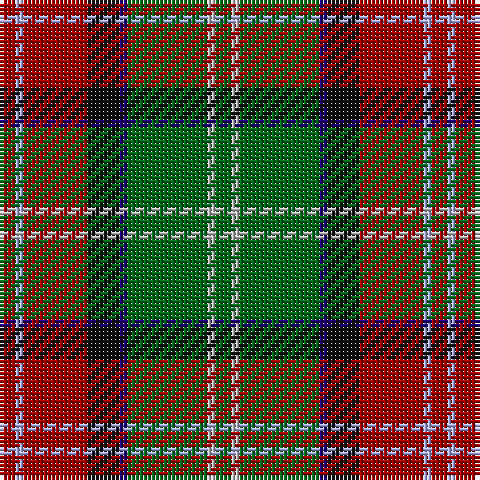

The parent of this is [Sawyer (Name)](/tartans/dr/4/lp2/dr16/k8/db2/g20/n2/g/4/)

This was sourced from tartans-authority.  It is a [8 stripes tartan](/stripes/stripes8/).

Original link http://www.tartansauthority.com/tartan-ferret/display/2162/

## Thread count
DR/4 LP2 DR16 K8 DB2 G20 N2 G/4

## Palette
Each colour and its ΔE from the base-6 reference it is a variant of.

| Colour | Shade | Base | ΔE (OKLab) |
|---|---|---|---|
| DB |  `#1C0070` | B  | 0.14 |
| DR |  `#A00000` | R  | 0.09 |
| G |  `#006818` | G  | 0.02 |
| K |  `#101010` | K  | 0.17 |
| LP |  `#A8ACE8` | W  | 0.22 |
| N |  `#B8B8B8` | Y  | 0.17 |

# Sample pattern

ID: /variants/dr/4/lp2/dr16/k8/db2/g20/n2/g/4-db1c0070-dra00000-g006818-k101010-lpa8ace8-nb8b8b8/
