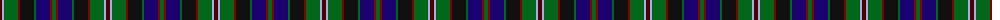

The parent of this is [MacCraig (Clan)](/tartans/dr/4/lp2/g14/dra2/k14/g2/db14/dra2/g/4/)

This was sourced from tartans-authority.  It is a [9 stripes tartan](/stripes/stripes9/).

Original link http://www.tartansauthority.com/tartan-ferret/display/3337/

## Thread count
DR/4 LP2 G14 DRa2 K14 G2 DB14 DRa2 G/4

## Palette
Each colour and its ΔE from the base-6 reference it is a variant of.

| Colour | Shade | Base | ΔE (OKLab) |
|---|---|---|---|
| DB |  `#1C0070` | B  | 0.14 |
| DR |  `#4C0000` | B  | 0.24 |
| DRa |  `#880000` | R  | 0.14 |
| G |  `#006818` | G  | 0.02 |
| K |  `#101010` | K  | 0.17 |
| LP |  `#A8ACE8` | W  | 0.22 |

ID: /variants/dr/4/lp2/g14/dra2/k14/g2/db14/dra2/g/4-db1c0070-dr4c0000-dra880000-g006818-k101010-lpa8ace8/
